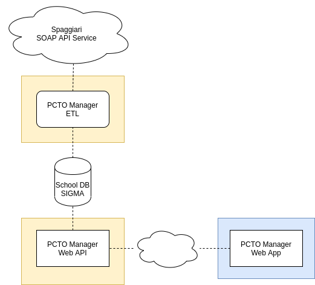

#  Architecture, Design and Coding Standards - Team 3 - PCTO manager

| **Author** | **Change Date** | **Description of changes** |
| ---------- | --------------- | -------------------------- |
| E. Bonoldi | 11/04/2020      | Initial Release            |
|            |                 |                            |

- [Architecture, Design and Coding Standards - Team 3 - PCTO manager](#architecture-design-and-coding-standards---team-3---pcto-manager)
  - [Introduction](#introduction)
  - [Design](#design)
  - [Architecture](#architecture)
    - [Companies](#companies)
    - [Students](#students)
  - [Techonologies](#techonologies)

## Introduction

This document describes the architecture and design for the PCTO Manager application.
The main goal of this application is to serve a better way to handle the PCTO activity in our school.

## Design  

We have to minimize complexity and development effort.
All our group works on a single task at a time.  

In order to accomplish our project we need to be sure to have the support from school technicians to operate on the DB.

The ideal design is this one.

## Architecture

The main concept is around the relation between **companies** and **students**.

### Companies 

Represents the phisical company that makes available PCTO activities for students.
Are exported via CSV as a copy of PCTO data from Spaggiari. 

### Students 

Operate PCTO activities within two dates (begin and end) in a certain Company.
Already in the school DB. 

## Techonologies

We have choose Laravel as ETL/Web API framework (PHP) and React as frontend library.
To test our application we used Docker to emulate the school DB and the PHP environment.