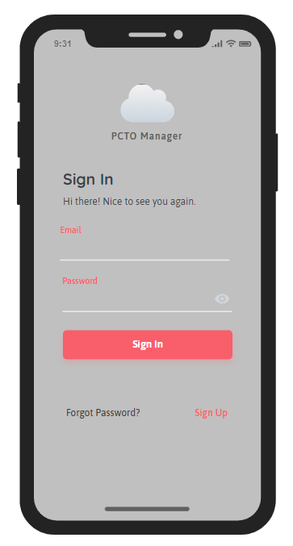
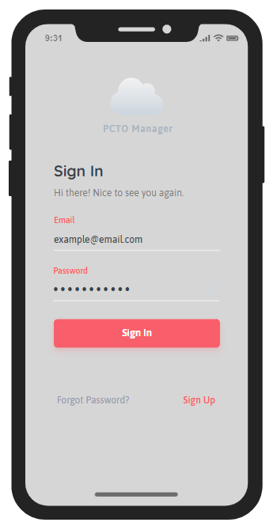
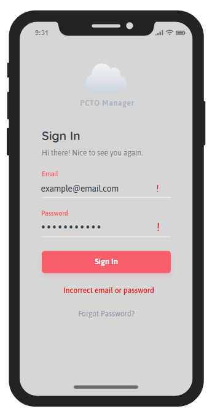

#  User Guide - Team 3 - PCTO manager

| **Author**   | **Change Date** | **Description of changes** |
| ------------ | --------------- | -------------------------- |
| L. Lorenzoni | 13/04/2020      | Initial Release            |
|              |                 |                            |

## Introduction

The PCTO Manager web application allows the user to manage his PCTO activities through a clear and easy to understand interface. This document will provide instructions for using the web application to view your activities.

## Quick Start Guide

1. Open a search engine and type pctomanager.marconiverona.edu.it. The login screen will appear.

2. Enter your E-Mail and Password.

1. Tap the Login button.

2. . Current PCTO activities will be displayed.

## System Requirements

The web application can be accessed from any device that is Mac, Linux, Windows and even IOS and Samsung.

## Main Scenarios of Use

### View Menù 

1. Slide your finger from left to right, you will open the main menu with the various sections.
2. Click on the section you want to visit

## Troubleshooting

1. Missing or Incorrect Password or E-Mail

A message will be displayed in the event incorrect login information is entered.  Try again with proper credentials to access the PCTO Manager.  

